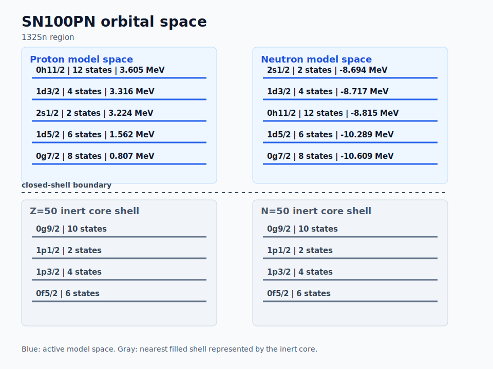

# sn100pn

`sn100pn` is a shell-model interaction for the 132Sn region on the `N <= 82` side. The KSHELL file uses a `Z=50, N=50` core convention, so nuclei are represented with proton and neutron particles in the 50-82 shell.

For example, `133Xe` can be represented as 4 valence protons and 29 valence neutrons outside a `100Sn`-like core. This avoids explicit hole bookkeeping, although the source paper often discusses the same physics using a 132Sn closed-shell reference and neutron holes.

## Model Space

Core in the KSHELL file:

```text
Z = 50, N = 50
```

Proton orbitals:

```text
0g7/2, 1d5/2, 1d3/2, 2s1/2, 0h11/2
```

Neutron orbitals:

```text
0g7/2, 1d5/2, 1d3/2, 2s1/2, 0h11/2
```

## Orbital Space



## Provenance

The local KSHELL file header says that `SN100PN` comes from `nushell@msu`, is based on `sn132g.int`, and is the interaction used in Brown et al., Phys. Rev. C 71, 044317 (2005).

The literal name `sn100pn` appears to be a NuShell/OXBASH/NuShellX interaction-library identifier rather than a name introduced in the paper itself.

## Files

- [files/kshell/sn100pn.snt](files/kshell/sn100pn.snt)

## Citation

B. A. Brown, N. J. Stone, J. R. Stone, I. S. Towner, and M. Hjorth-Jensen, "Magnetic moments of the 2+1 states around 132Sn," Phys. Rev. C 71, 044317 (2005). DOI: [10.1103/PhysRevC.71.044317](https://doi.org/10.1103/PhysRevC.71.044317)
